# es5-
跟随Coderwhy老师视频，自己整理的es5数据结构实现代码和笔记，持续更新


# JS数据结构与算法

## 1.java和js数组的区别

1.常见语言的数组不能存放不同的数据类型，因此所有在封装时通常存放在数组中的是Object类型

2.常见语言的数组容量不会改变（需要进行扩容操作）

3.常见语言的数据进行插入和删除操作性能较低

## 2.栈结构

数组是一种线性结构，可以在任意位置插入和删除数据

栈和队列比较常见的受限的线性结构，对插入和删除的任意性进行限制

栈只能在栈顶进栈和出栈

后进先出(LIFO)

**eg**

自助餐的托盘，最新放上去的，最先被客人拿走使用

收到很多的邮件，从上往下依次处理这些邮件


函数调用栈

A调用B， B中调用C，C调用D

A压入栈，B再压入栈-----

A在栈底，D在栈顶

D执行完，弹出栈。C/B/A依次弹出栈


递归如果单次效率很低，很容易溢出栈


**面试题**
有六个元素6,5,4,3,2,1的顺序进栈，请问下列哪一个不是合法的出栈顺序

A. 5 4 3 6 1  2	B. 4 5 2 3 1 6	C. 3 4 6 5 2 1 	D. 2 3 4 1 5 6

**解析**

A：5出栈，6压栈。所以一定是5出栈，4马上进栈；4出栈，3马上进栈。。

B： 4，5，6进栈，4，5出栈，3进栈，3出栈；。。

C： 3，4，5，6进栈，3，4出栈，6没法出栈，错误

D：。。。

**所以选C**


实现方式

1. 基于数组实现
2. 基于列表实现

栈的操作

	1. push
	2. pop
	3. peak：查看栈顶元素，不会做任何修改
	4. isEmpty: 判断栈是否为空
	5. size()
	6. toString: 将栈结构的内容以字符形式返回


十进制转成二进制


## 3. 队列结构

首先的线性表，先进先出（FIFO）

受限之处在于它只允许在表的前端进行删除，

而在表的后端进行插入操作

**e.g.**

电影院，商场排队

打印队列

五份文档需要打印，依次放入到打印队列中

打印机会依次从队列中取出文档

**线程队列**

多线程，不能并行处理（太占内存）

开启线程处理任务的情况，就会使用线程队列

***击鼓传花***

很多人围成一圈，从某位同学手中向另外的同学传递花，一旦班长击鼓，那么将会 停止。

修改规则：

每个人开始数数，数到某个数字淘汰，最后剩下的人为获胜的人。


<h4>优先级队列</h4>

优先级队列在插入一个元素的时候会先考虑该数据的优先级

每个元素不在只是一个数据，而且包括优先级

{data: , priority: }

**example**

机场的登机顺序（头等舱和商务舱）

急诊科（病情严重）

线程（任务的重要性分布）


封装元素和优先级放在一起，封装一个新的构造函数

添加元素时，将新插入的优先级和已经存在的元素优先级比较。


## 4.链表

数组是最常用的数据结构

数组的缺点

- 创建需要一段连续的内存空间，并且大小是固定的，当数组不能满足时，需要进行扩容
- 在数组的开头或中间位置插入数据的成本很高，大量数据的移位

链表的优势：

- 存储多个元素，不必是连续的空间
- 一个存储元素本身的节点和指向下一个元素的引用
- 大小可以无限的延伸
- 充分利用计算的内存，实现灵活的内存动态管理
- 插入和删除数据时，时间复杂度为O(1)

链表的缺点：

- 访问元素需要从头开始访问
- 无法通过下标直接访问元素

链表类似于火车头

- 乘客：data
- 下一个节点：下一个火车头

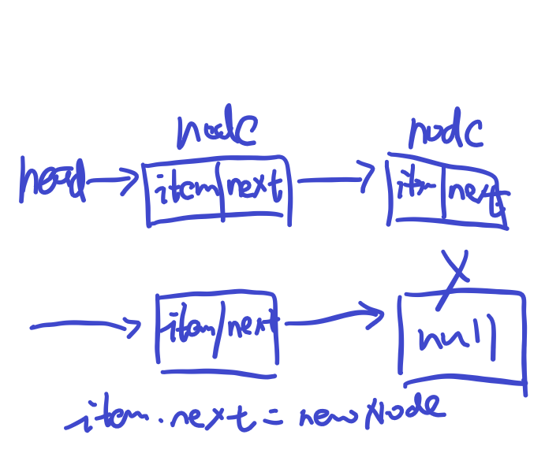

在LinkedList里面有一个Node类，用于封装每一个节点上面的信息

链表中我们保存两个属性，一个是链表的长度，一个是链表中的第一个节点。

链表的常见操作:

- append(element):向列表的尾部添加一个新的项
- insert(position, element)：将元素插入到相应位置，项指针变换
- get(position): 获取对应位置的元素
- indexof(element):根据元素，获取对应的索引值
- update(position): 修改某个位置的元素
- removeAt(position)：从列表的特定位置移除一列
- remove(element)：从列表中移除一项
- isEmpty
- size
- toString

append: 默认header指向null，根据数据创建节点，如果是第一个节点，需要让header指向当前节点。

如果不是第一个节点，创建节点，找到当前节点的上一个节点，next指针指向这个节点。

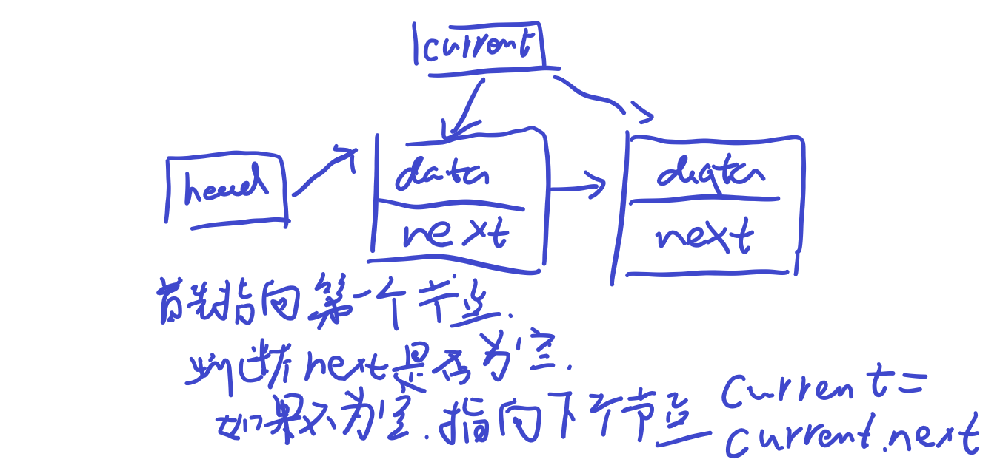


insert:

越界判断（负数，长度）

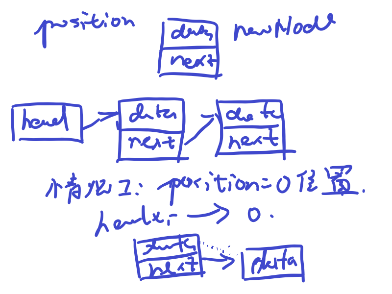

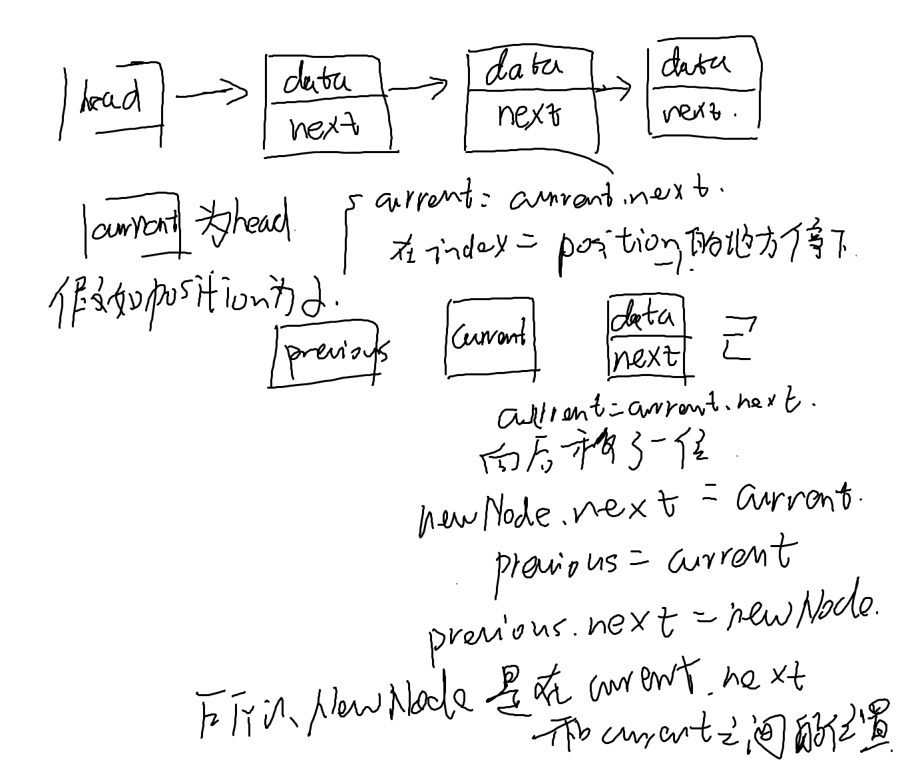

current是倒数第二个

只要让newNode介于倒数第二个和倒数第一个之间就行了


removeAt(position)
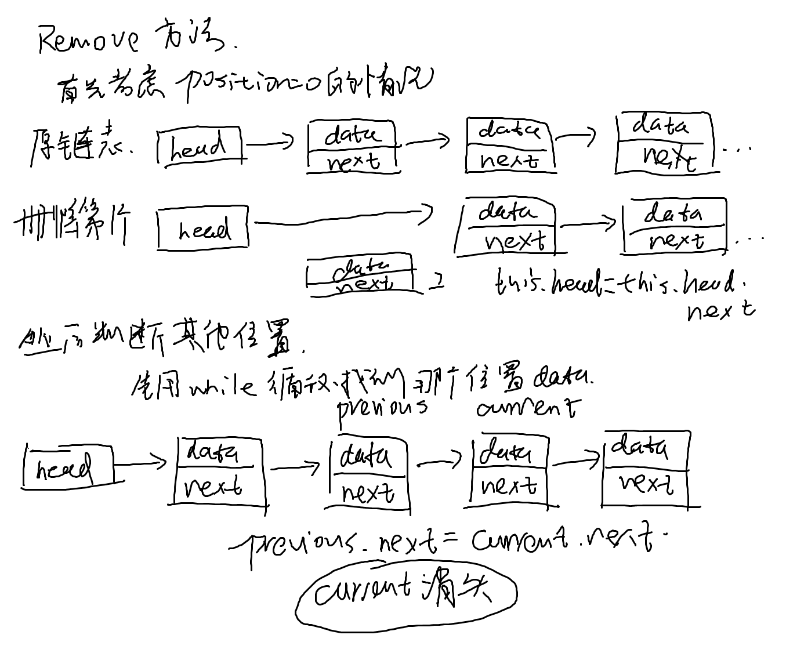

和insert差不多，先用while(index < position)搜寻到当前位置的节点 


## 5.双向链表

单向链表：

- 只能从头遍历到尾或者从尾遍历到头
- 链表相连的过程是单向的
- 实现的原理是**上一个链表有指向下一个链表的引用**

缺点：

- 我们可以轻松的到达下一个节点，但是回到前一个节点是非常困难的。
- 但是实际开发中需要考虑双向的问题
- 如果向前遍历，需要从第一个节点开始从头循环。

双向链表：

- 既可以从头遍历到尾，又可以从尾遍历到头
- 一个节点既有向前连接的引用，也有一个向后连接的引用

缺点：

- 每次插入或者删除某个节点，需要处理四个引用，实现起来要困难一些
- 相对于单向链表，占用的内存更大了

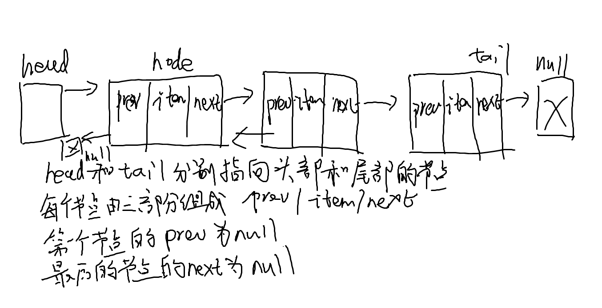

所以head和tail是两个额外的指针，永远指向第一个和最后一个，和元素本身的prev和next没关系

需要封装的方法和单项链表是相同的，

唯一不同的增加了两个方法

- forwardString()
- backwardString()

**append**

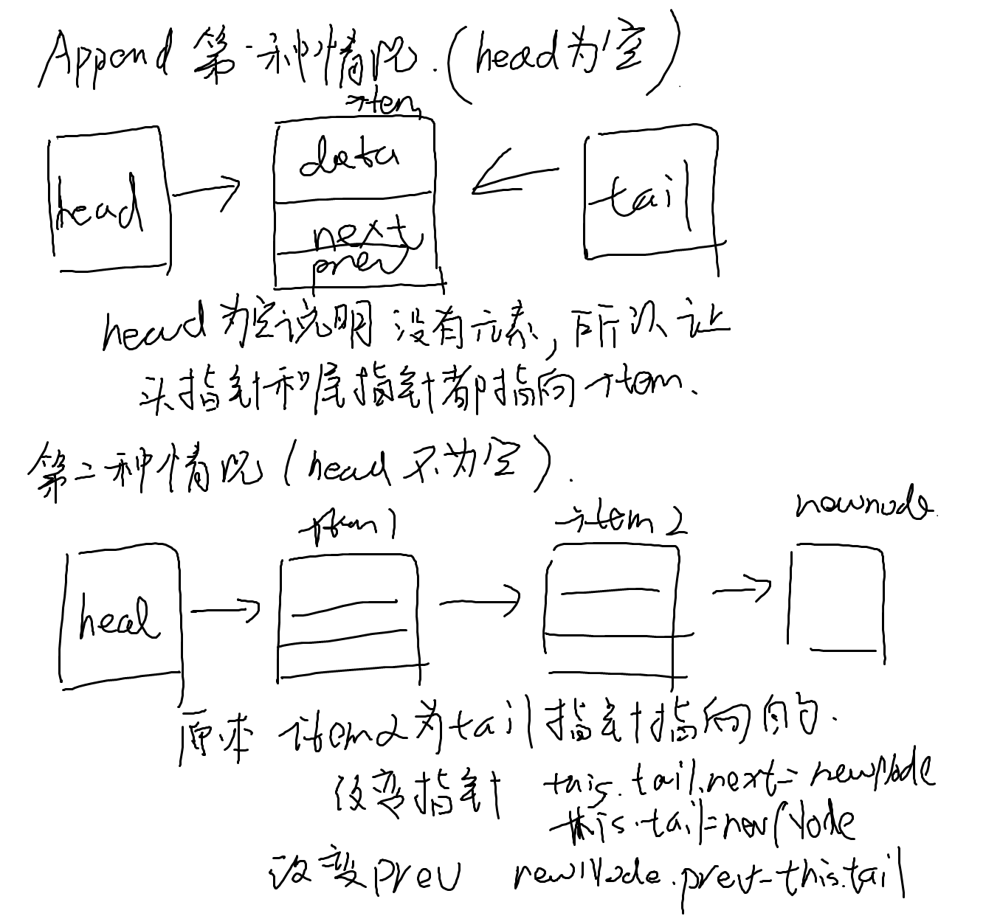

有了尾指针，不需要从头遍历了，很方便。

**insert**

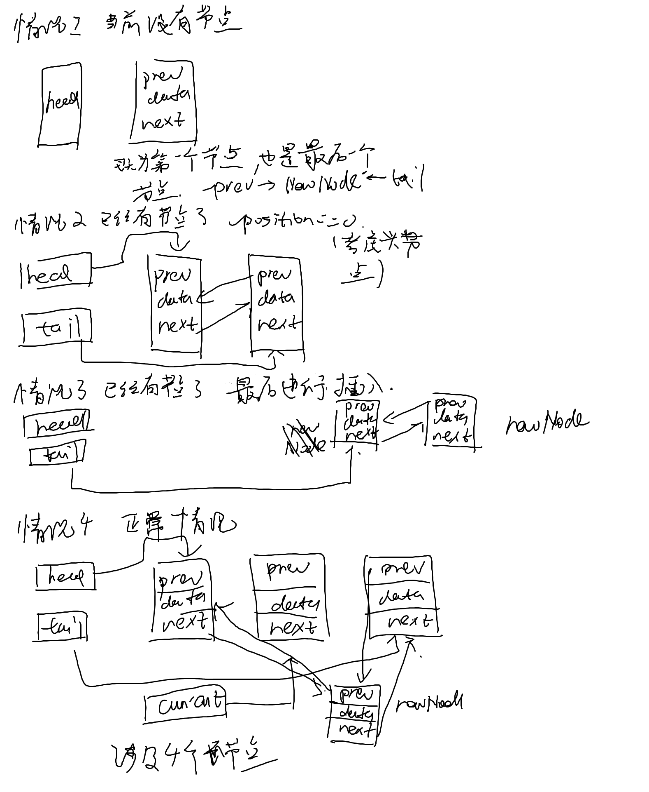

**removeAt**

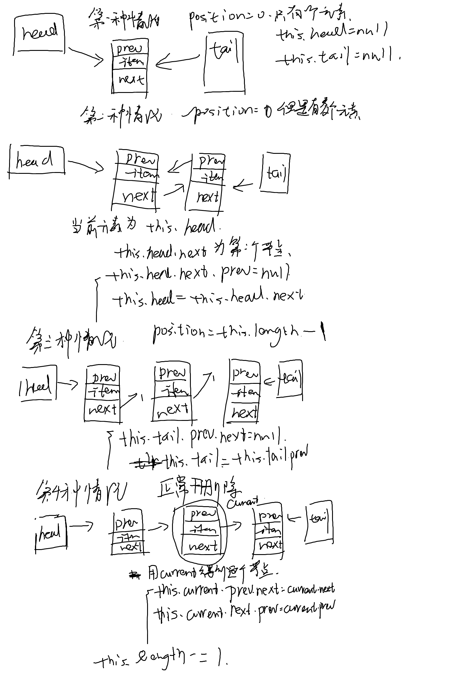

## 6.集合（Collections）

- 集合比较常见的实现方式是哈希表，这里用Object进行封装
- 集合通常是一组无序的，不能重复的元素构成的
  - 和数学中的集合名词比较类似，但是数学中的集合范围更广，允许重复
  - 计算中，集合通常表示结构中的元素是不允许重复的
- 特殊的数组
  - 没有顺序，也不能重复
  - 没有顺序意味着不能用下标值进行访问，不能重复意味着相同的对象在集合中只会存在一个
- Es6中封装了set类，可以直接使用

**集合的操作**

- add(val): 向集合中添加一个新的项
- remove(val): 
- 从集合中移除一个值
- has(val): 判断值是否在集合中
- clear(): 清空所有的项
- size(): 返回集合包含的元素数量
- values(): 返回一个包含所有值的数组

**集合之间的操作**

- 并集：返回一个包含两个集合中所有元素的新的集合
- 交集：返回两个集合中共有元素的新集合
- 差集：返回一个包含于第一个集合且不包含于第二个集合的元素的集合
- 子集：A集合全部包含于B集合，称为子集

**并集的实现**

- 创建一个集合，代表并集，
- 遍历A集合，得到所有的元素
- 遍历B集合，得到所有的元素
- 元素加入到并集中

**交集的实现**

- 创建一个新的集合
- 遍历集合1中的元素
- 将集合1中的元素和集合2中的比对，使用has方法
- 相同的元素放入到并集中

**差集的实现**

- 创建一个新的集合
- 遍历集合1中的元素
- 如果集合1的元素不在集合2中，使用！has方法
- 放入到并集

**子集的实现**

- 创建一个集合
- 遍历集合1中的元素
- 如果集合1中的元素有一个不在集合2中，返回false
- 不然返回true


## 7.字典（dictionary）

字典的主要特点是**一一对应**的关系(键值对)

使用字典的方式{"age": 18, "name": "sd"}

字典可以方便的通过key来搜索对应的value, key有特殊的含义，也更容易被人记住


## 8.哈希表(Hash table)

- 基于数组实现的
- 可以提供非常迅速的插入删除查找操作
- 无论多少数据，插入和删除都是接近常量的时间，即0(1)的时间级。
- 哈希表的速度比树还要快
- 编码比较容易

缺点：

- 数据是无序的，不能按照固定的方式来遍历元素
- Key是不允许重复的，不能放置同样的key，用于保存不同的元素

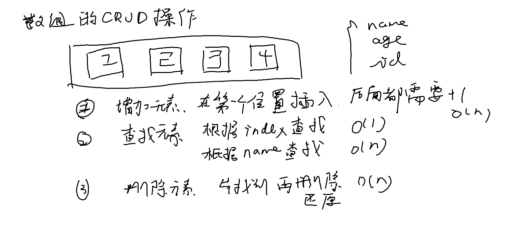

什么是哈希表？

- 结构还是数组，但是对下标值进行了一种变换，称为hash function，通过hash function 可以获取到hash code


**案例分析**

1. 加入公司有1000个员工， 希望将这些员工用一种数据结构进行存储。

方案1：使用数组

要查找具体员工的信息，一个一个找

必须添加一个员工号，员工号对应着index，这样通过index快速定位到员工

方案2：使用链表

只能从头开始或者从尾开始找，不合适

优势在于插入和删除，员工相对比较固定，优势无


**最终选用数组**，但是只能绑定一个id？如果无id还不如链表

使用hash function，让名字转换到id


2. 选择一个数据结构，保存联系人和电话

方案1：使用数组

- 如果查询某个联系人，需要从头开始遍历
- 可以将联系人和对象封装成为一个对象，这样就有了index

方案2：使用链表

- 还是毫无优势

还是名称 =》下标值


3. 50000个单词转储

单词：翻译，读音，应用

方案1：使用数组

拿到一个单词，想要知道读音和应用

线性查找，50000次比较

方案2：链表

方案3：将单词转换成数组的下标值

python => 1000

java => 2000

javascript => 3000

单词名称 =》 下标值


### 字母转成数字的方案

编码         ASCII

​				ISO-8859-1

​				GBXXXXX

​				GBK

​				Unicode(UTF-8)

方案1：每个单词的编码求和(cats = 3 + 1 + 20 + 19 = 43,43作为下标值)

​	下标值太少了，很容易重复

方案2：幂的连乘(cats = 3 * 27^3 + 1 * 27^2 + 20 * 27 + 17 = 60337)因为一共有26个字母+一个空格键

​	问题：如果有zzzzzzzzzzz这种字符

那么这个下标值太大了，数组直接爆炸了

而且这么大的数组，里面基本上都是空位置，因为那些地方不是单词


### 哈希化

如果5000个单词，往往需要更大的空间，比如10000长度的数组

如何将之前特别大的数组压缩呢

- 取余操作

假设0-199之间数字为largeNumber

压缩到0-9之间为smallRange

index = largeNumber mod smallRange

**在0-199之间取5个数字，放到0-10之内**

<p style="color:blue">哈希化</p>：将大数字转化成数组范围内的下标的过程，称之为哈希化

<p style="color:blue">哈希函数</p>：单词转为大数字，大数字在哈希化的代码放在一个函数中，这个函数我们成为哈希函数

<p style="color:blue">哈希表</p>：最终将数据插入到的这个数组，对整个结构的封装，我们称之为一个哈希表


## 哈希冲突

单个位置有多个单词（多个元素）

如果只是取模操作，冲突是不可避免的

常见的解决方案：

- 链地址法
- 开放地址法

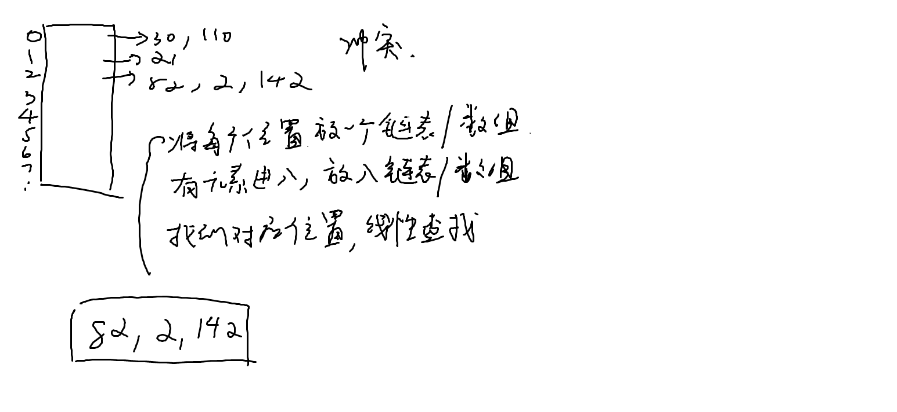

**链地址法**

1. 链地址法解决冲突的办法是每个数据单元不再存放单个数据，而是一个链表或者数组
2. 如果是链表，每个数组单元中存放着一个链表，一旦发现重复，将重复的元素插入到末端即可
3. 查询时，根据哈希话后的下标值找到对应的位置，取出链表，再一一比对得到数据（O（n））
4. 在这里数组和链表效率差不多，插入元素都是append，时间为o(1)，拿出来的时候都是线性查找，时间为O(n)
5. 某些时候将新数据是插入到第一个的，这时候使用链表，插入时间为O(1)

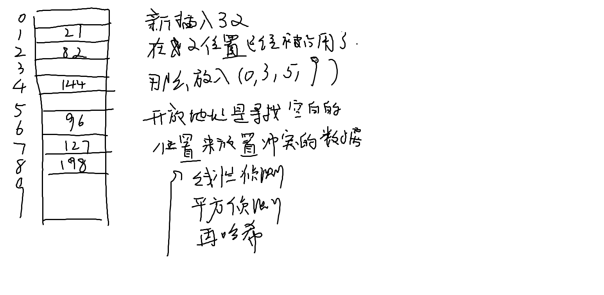

**开放地址法**

- 线性探测

线性探测非常好理解，线性的查找空白的单元

插入32：

经过哈希化得到index = 2

线性探测就是从index位置+1开始找到空白的位置放置32

查询32：

首先经过哈希化得到index=2，比如2的位置和查询的数字是否相同？

不相同就进行线性查找，从index+1开始查找和32相同的，

找到第一个空白位置就停止了，**因为空白出现代表肯定没有了**

删除32：

删除一个数据项时，不可以置为null

**e.g.**

3为32，5为62，那么一旦3置为null，想要查询62就查不到了

所以设置成特殊的值，比如为-1

<p style="color: blue">线性探测的问题</p>

​	聚集问题，比如在没有任何数据的时候，插入22-23-24-25-26，那么意味着下标2-3-4-5-6位置都有元素

这种一连串的单位填充称为聚集。

对插入、删除、查询的效率都会有影响

插入32，连续的单元都不允许放置数据，并且这个过程要探索多次

- 二次探测

背景：

如果数据是连续插入的，新插入的数据要探测很长的距离

实现：

二次探测，对步长进行了优化，比如从下标值x开始，x + 1^2, x + 2^2, x + 3^2

这样可以一次性探测比较长的距离，避免聚集带来的影响

问题：

比如插入的是32-112-82-2-192,步长不一的聚集

- 再哈希法

二次侦测的算法产生的探测序列步长是固定的，1， 4， 9， 16.。

需要一种方法：产生一种依赖关键字的探测序列

比如：2 - - 对应关键字key a

​			32 -- 对应关键字key b 

​			112 - - 对应关键字key c

不同的关键字映射到相同的下标值，也可以使用不同的探测序列

**第一次哈希**：得到下标值

**第二次哈希**：得到步长

特点：

1. 和第一个哈希函数不同

2. 输出结果不能为零

stepSize = prime_num - (key mod prime_num)


## 哈希的效率

如果发生冲突，存取时间久以来后来的探测长度

平均探测长度和平均存取时间，取决于填装因子，填装因子变大，探测长度越来越长

填装因子：

fator = 总数据项 / 哈希表长度

**Knuth算法的结果**

- 二次探测和再哈希比线性探测好
- 总的来说控制在2/3之内比较好
- 链地址法比较平稳


## 好的哈希函数

让哈希函数中的乘法和除法尽可能少

- 快速的计算
- 均匀的分布

计算哈希值的过程

a(n)x ^ n + a(n-1)x ^(n-1) + a(n-2)x ^(n-2) ...

乘法 n+ (n-1) + ... + 1 = n(n+1) / 2

加法 n

使用霍纳法则

乘法次数：n次

加法次数：n次

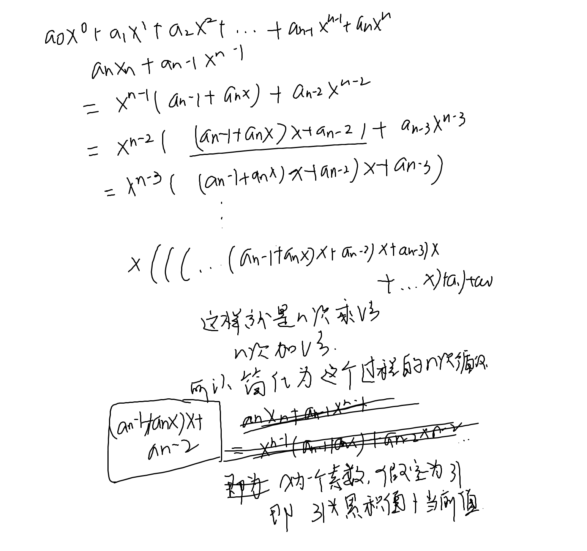

如何均匀的分布?

使用常量的地方尽可能使用质数

- 哈希表的长度
- N次幂的底数

哈希表长度

假设表长为15，步长为5，映射到0

0 - 5- 10- 0- 5 - 10

假设表长为13

0 - 5 - 10 - 2 - 7 - 12 。。。

不会产生循环，还可以让数据在哈希表上分布更加均匀


## 哈希表的扩容

链地址法，loadFactor理论上可以大于1

但是数据量增多，index对应的bucket越来越长，会造成查询时的效率降低

哈希表进行扩容后，需要重新的进行哈希化

一般在loadFactor>0.75的时候就需要进行扩容

### 哈希表扩容为质数

- 判断一个数是否为质数

最简单的做法

```js
function isPrime(num) {
    for (let i = 2; i < num; i ++) {
        if (num % i == 0) {
            return false
        }
    }
    return true
}
```

但是其实一个数字一旦可以因数分解，分解到的数字必定小于sqrt(n)

比如16，最大4*4，一定有一个小于4

所以其实最后其实范围为

```js
Math.floor(Math.sqrt(num))
```

这样只要涉及一个函数得到对应的质数

```js
function get_prime(num) {
	while (! isPrime(num)) {
		num ++
	}
	return num
}
```

实现了质数扩容


## 9.树结构

- 根
- 树枝
- 叶子

例子：公司的组织架构

​			家谱

树结构就是针对这些实际例子的抽象

### 树结构的优点

- 数组：

  - 优点
    1. 数组根据下标值查找效率很高
    2. 比较好的方式是先进行排序，再进行二分查找
  - 缺点
    1. 需要先进行排序，生成有序数组，才能提高效率
    2. 插入和删除数据时，需要大量的位移操作，效率很低

- 链表

  - 优点
    1. 链表的插入和删除效率都非常高
  - 缺点
    1. 查找的效率很低，需要从头或者从尾访问每个数据项
    2. 即使删除效率很高，也得先找到这个元素

- 哈希表

  - 优点
    1. 插入，查询，删除效率都非常的高（进化的数组）
  - 缺点
    1. 空间利用率不高，底层使用了数组，并且某些地方没有使用
    2. 元素是无序的，不能固定的访问
    3. 不能快速的找到最大最小这种特殊值

- 树结构

  弥补了一些以上数据结构的缺点，综合了一些优点

  可以表示一对多的关系（目录结构）

### 

### 树结构的术语

1. Tree: n (n >= 0)个节点构成的有限集合
2. root
3. 其他节点可以分为m个互不相交的有限集T1，T2， T3 ... Tm，其中每个集合本身又是一棵树，称为子树（subtree）
4. Degree(度): 节点的子树个数
5. depth: 最大层次
6. degree of a tree: 树的最大节点度
7. path: 由边组成的集合

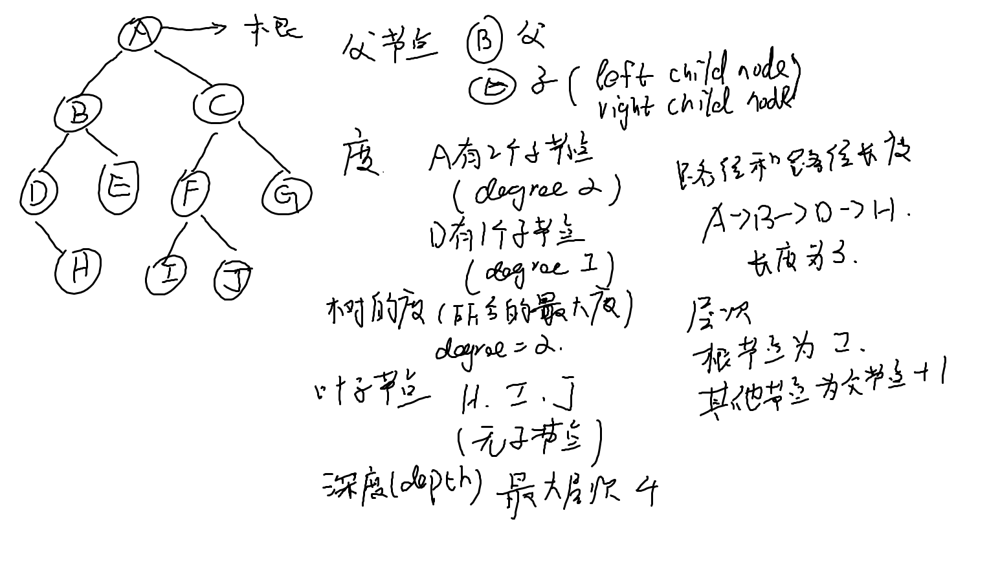

### 树结构的表示方式

儿子-兄弟表示法：

<p style="color: blue">两个子节点：第一个节点放左儿子，第二个节点放右兄弟</p>

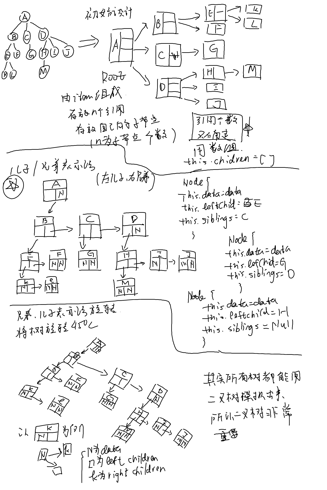


### 二叉树

树的每个节点最多只能有两个子节点，称为二叉树

二叉树可以为空，

若不为空，它是由根节点和左子树TL和右子树TR的两个不相交的二叉树组成的。

二叉树的几个特性

- 一个二叉树第i层的最大节点数为 2 ^(i - 1)，i>=1

- 深度为k的二叉树有最大节点数为2 ^ k - 1, k >= 1

- n0为叶节点的个数，n2为度为2的非叶子节点个数

  两者满足关系 n0 = n2 + 1

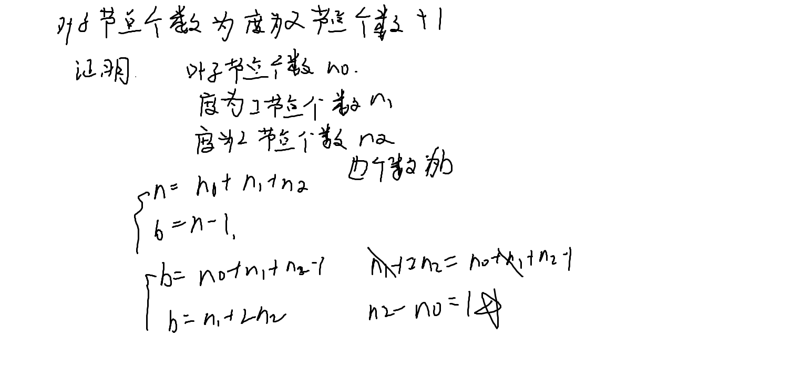

满二叉树

除了叶子节点之外，所有的节点都是包含两个节点

完全二叉树

除了最后一层，所有层的节点数达到了最大个数，

且最后一层的节点从左向右是连续存在的

满二叉树是特殊的完全二叉树


二叉树的存储方式

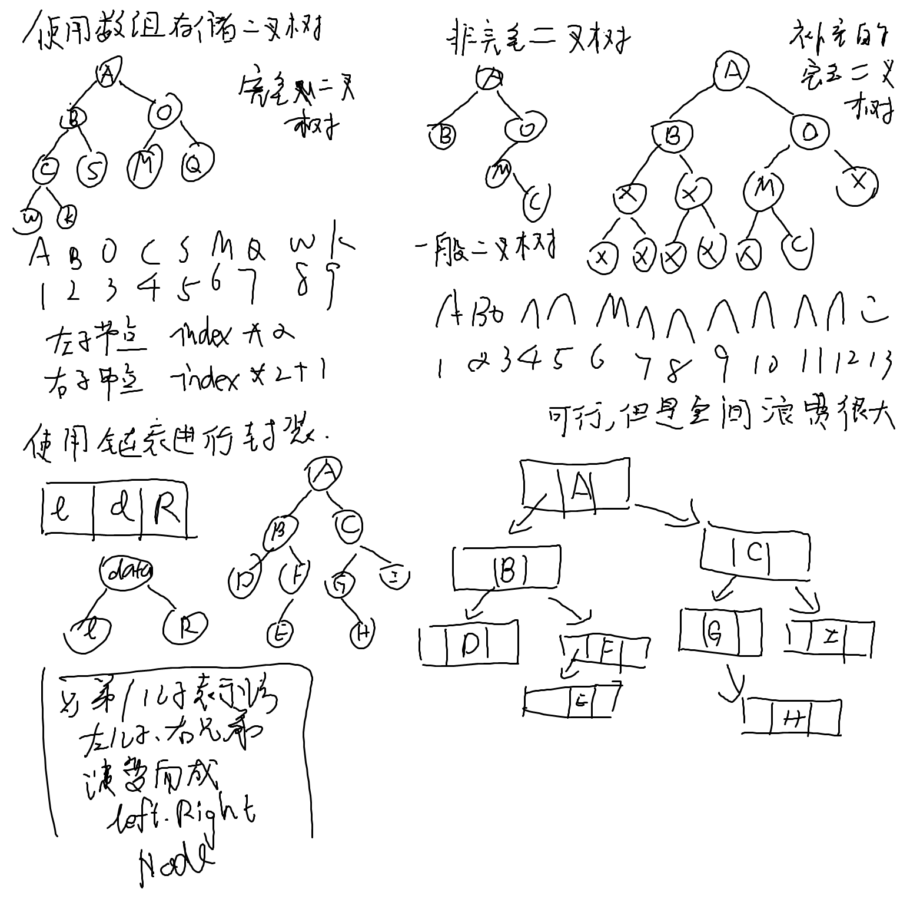

### 二叉搜索树

本身可以为空树

如果不为空，满足下列调价

- 非空左子树的所有键值小于其根节点的键值
- 非空右子树的所有键值大于其根节点的键值
- 左右子树本身也是二叉搜索树

优点：

- 查找效率高
- 本质上是二分查找，时间为log(n)

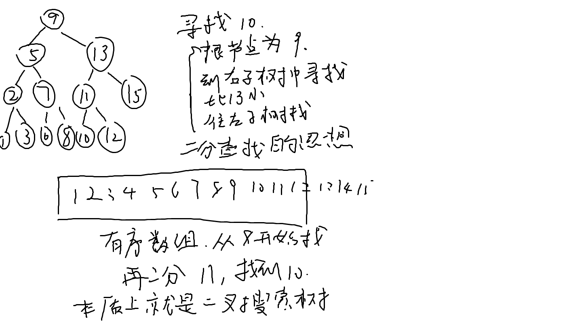

组成结构：

left--key--val--right


常见操作：

1. insert(key)插入一个键

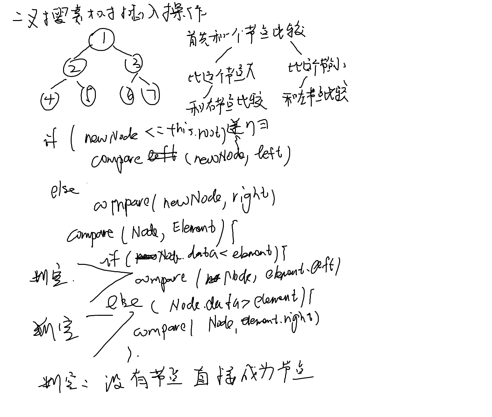

代码：

```js
BinarySearchTree.prototype.insert = function (key) {
        // 根据key创建节点
        let newNode = new Node(key)
        // 判断是否存在根节点
        if (this.root == null) {
            this.root = newNode
        } else {
            this.insertNode(this.root, newNode)
        }
    }

    BinarySearchTree.prototype.insertNode = (node, newNode) => {
        /**
         * node: 和新节点比较的node
         * newNode: 新节点
         */
        if (newNode.key < node.key) {
            // 向左查找
            // 左子节点为空,成为这个节点
            if (node.left == null) {
                node.left = newNode
            }else {
                this.insertNode(node.left, newNode)
            }
        }else {
            // 向右查找
            // 右节点为空,成为这个节点
            if (node.right == null) {
                node.right = newNode
            }else {
                this.insertNode(node.right, newNode)
            }
        }
    }
```


1. search(key)查询一个键，若果存在，返回true，不存在，返回false

2. inOrderTraverse: 中序遍历

   - 中序遍历左子树
   - 访问根节点
   - 中序遍历右子树

   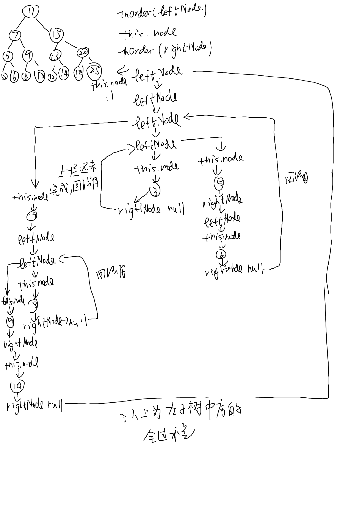

3. preOrderTraverse: 先序遍历

   - 先访问根节点
   - 先序遍历左子树
   - 先序遍历右子树

   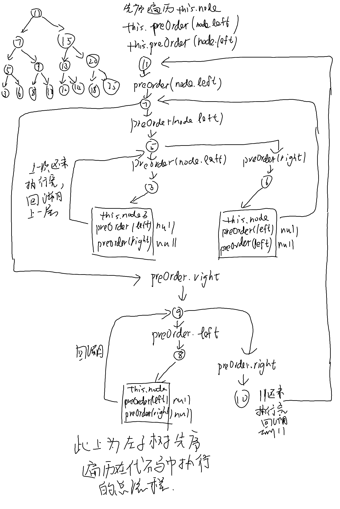

4. postOrderTraverse: 后序遍历

   - 先访问左子树
   - 再访问右子树
   - 最后访问根节点

   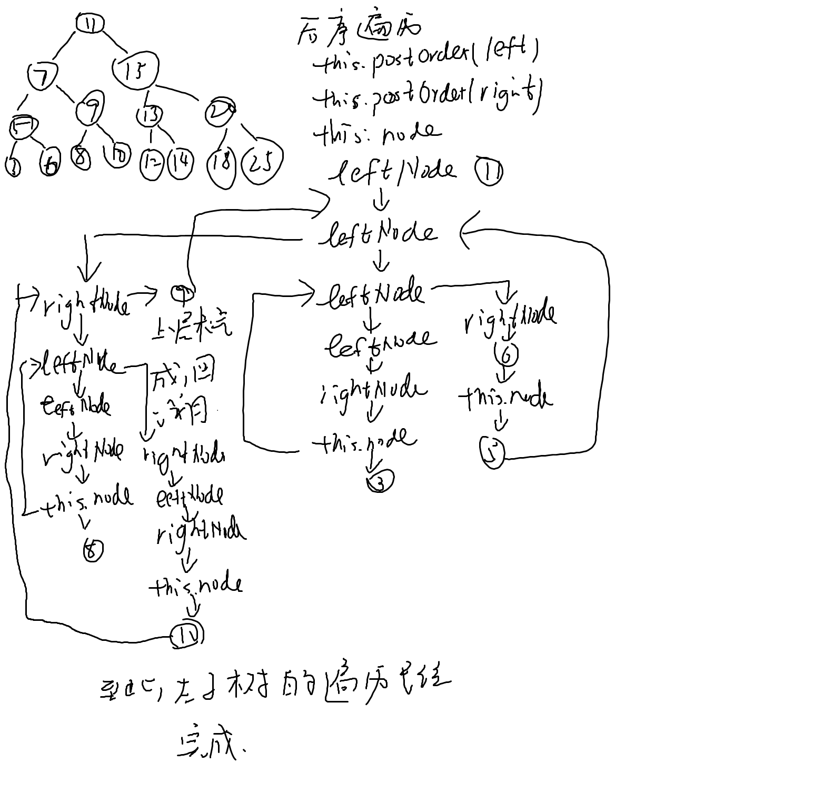

5. remove(key) : 删除某个键

   - 找到节点

     ```js
     // 寻找要删除的节点
             let current = this.root
             let parent = null
             let isLeftChild = true
     
             // 开始寻找删除的节点
             // 大条件：查找的节点和当前节点不相同
             while (current.key != key) {
                 parent = current
                 if (key < current.key) {
                     isLeftChild = true
                     current = current.left
                 }else {
                     isLeftChild = false
                     current = current.right
                 }
     
                 // 没有找到，已经找到了叶节点，依然没有相等的key
                 if (current == null) {
                     return false
                 }
             }
     ```

     

   - 该节点为叶节点

     ```js
     if (current.left == null && current.right == null) {
         // 删除节点是根节点，并且也是一个根节点
         if (current == this.root) {
             this.root = null
             // 根据isLeftChild来判断是左子节点还是右子节点
         }else if (isLeftChild) {
             parent.left = null
         }else {
             parent.right = null
         }
     }
     ```

   - 该节点有一个子节点

     直接删除，然后将当前节点替换为它的左子节点

     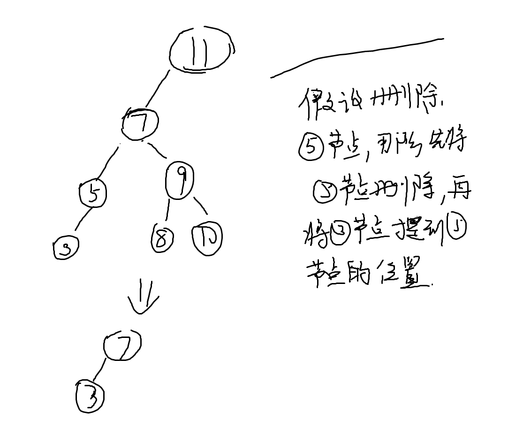

   - 该节点有两个子节点

     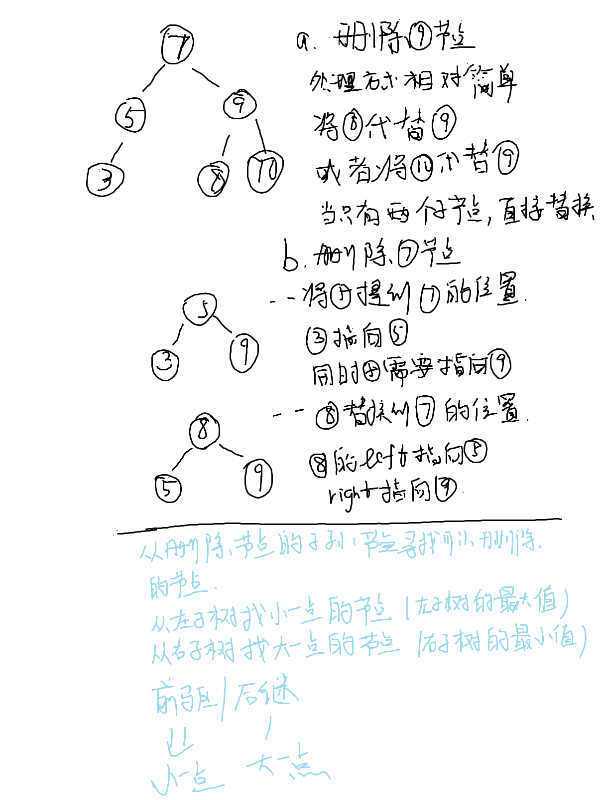

   <font color="blue">重点是找到前驱或者后继的节点，然后进行替换</font>

   **如果后继节点不是删除节点的右节点，那么右节点同时需要确定**

   **同时后继节点如果存在右节点，那么必须同时提上去成为后继节点parent的left成为后继节点的right**

   

6. search(key)：查找某个键

   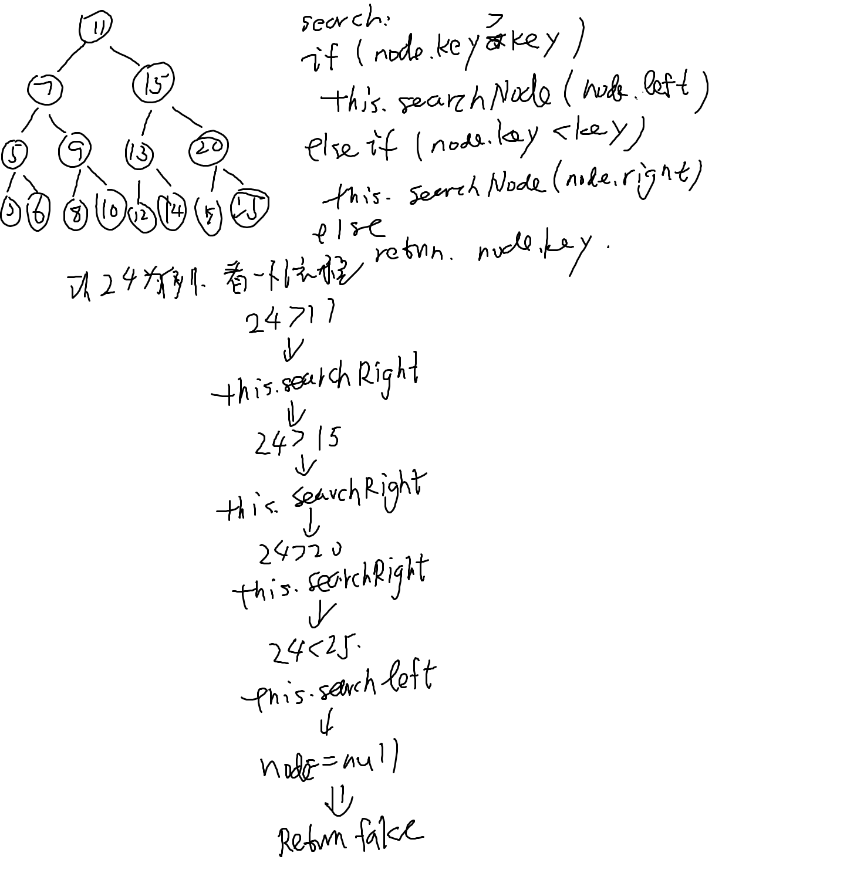

   代码：

   ```js
   BinarySearchTree.prototype.search = (key) => {
           return this.searchNode(this.root, key)
       }
       BinarySearchTree.prototype.searchNode = (node, key) => {
           // 如果根节点为空，直接返回
           if (node == null) {
               return false
           }
   
           if (node.key > key) {
               return this.searchNode(node.left, key)
           }else if (node.key < key) {
               return this.searchNode(node.right, key)
           }else {
               return true
           }
       }
   ```

   

7. min: 返回树中最小的键

8. max: 返回树中最大的键

二叉搜索树的缺点

- 如果插入的数据是有序的数据，那么会非常的麻烦
  - 比如插入 7 6 5 4 3 2， 这样一棵树深度会非常的深，全部聚集在左子树上
  - 这样这个树的优势就丧失了，因为查找3，直接找到最深处，那么log(n)失效
  - 这种情况近似于链表，查找效率为O(n)

所以我们需要保证树的平衡性，尽可能保证左子树等于右子树


### 红黑树

红黑树，除了满足二叉搜索树的基本规则外，还添加了以下的特性

1. 节点是红色或者黑色
2. 根节点是黑色
3. 每个叶子节点都是黑色的空节点(NIL)
4. 每个红色节点的两个子节点都是黑色(从每个叶子节点到根上的所有路径不会包含连续的两个红色节点)
5. 从一个节点到其每个叶子的所有路径都包含相同数量的黑色节点

上面的约束，确保了这些关键特性：

1. 最长根节点到叶子节点的路径，不会超过最短路径的两倍
2. 这个树就是基本平衡的
3. 虽然没有完全平衡，但是依然比较高效

为甚么可以做到最长路径不超过最短路径的两倍呢

1. 路径中不能有两个相同的红色节点
2. 最短的可能路径都是黑色节点
3. 最长的可能路径是黑色和红色节点的交替
4. 同时所有路径都有相同数目的黑色节点
5. 所以没有路径能多于其他任何路径的两倍

三种红黑树的变换方式

- 变色

  为了重新符合红黑树的规则，让红色节点变成黑色，或者让黑色节点变成红色

  **需要知道新的节点一般都是红色的**

  因为如果插入的是黑色的，必然会有一条路径上面多了黑色的节点，那么根据第五条规则，

  其他路径相应的肯定要做出改变

  红色节点可能会产生红红相连的情况，但是这些情况可以通过颜色的调换进行相应的调整

- 左旋转

  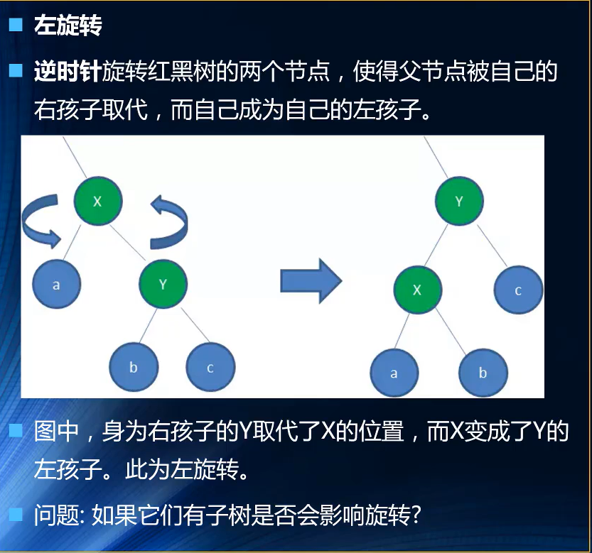

- 右旋转

  

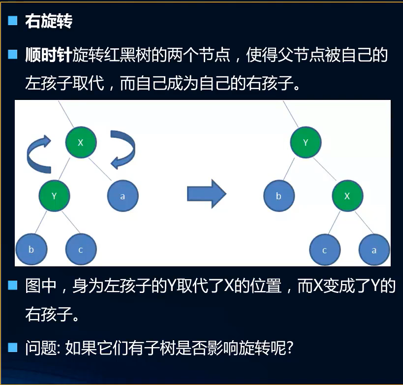


- 变换规则

  - 术语

    - N节点
    - P节点
    - G节点
    - U节点

  - 情况一

    - 新节点N位于树的根上，没有父节点
    - 这种情况下，直接将N节点变为黑色即可

  - 情况二

    - 新节点的父节点P是黑色的
    - 这样插入的新节点不需要变色，直接插入
    - 尽管新节点N有两个黑色的新NIL节点，但是通过它的路径中黑色的个数依旧相同，满足了性质五

    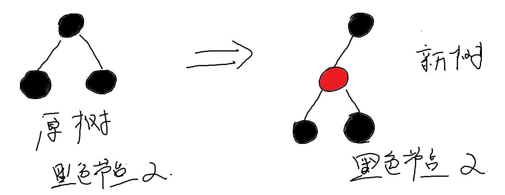

  - 情况三

    - P为红色，U也为红色
    - 父红叔红祖黑
    - 操作方案
      - 将P和U变为黑色，并且将G变为红色
      - 现在新节点N有一个黑色的父节点P，所以每条路上的数目没有改变
      - 而从更高的路径上，必然都会经过G节点，所以那些路径的黑色节点数目也是不会改变的
    - 可能出现的问题
      - G节点的父节点也有可能是红色的，违反了性质3
      - 如果递归调整到了根节点，需要进行旋转

    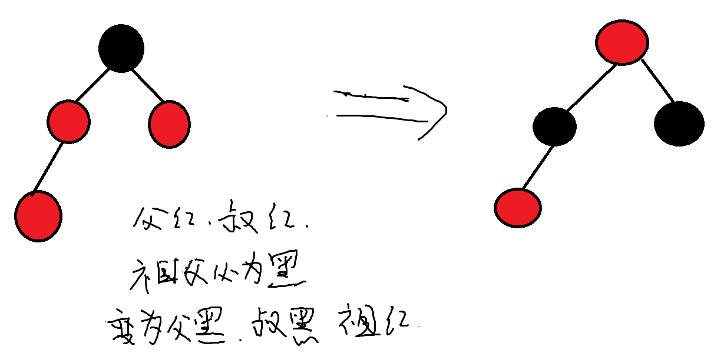

  - 情况4
    - N的叔节点U是黑色的，N是左孩子
    - 父红叔黑祖黑，N是左儿子
    - 操作方案
      - 父黑
      - 祖红
      - 右旋转
      - 对祖父节点G进行依次右旋转
      - 以前的父节点P现在是新节点已经以前祖父节点G的父节点
      - 交换以前的父节点P和祖父节点G的颜色
      - B节点向右平移，成为G节点的左子节点
    - 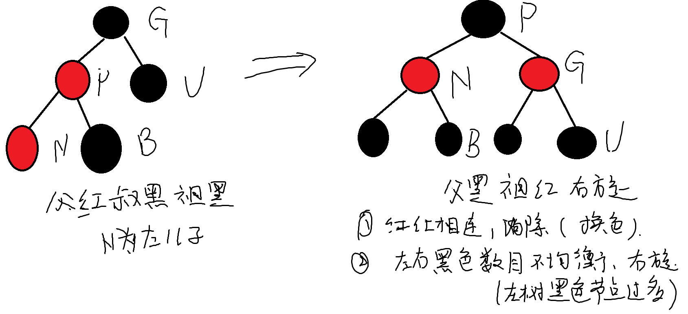

  - 情况5
    - N的叔节点U是黑色节点，且N是右孩子
    - 父红叔黑祖黑，N是右孩子
    - 解决方案
      - 对P节点进行依次左旋转，形成情况四的结果
      - 对祖父节点G进行一次右旋转，并且改变结果


## 10. 图论

### 	什么是图
- 图结构是一种和树结构有相似结构的数据结构


- 图论是数学的分支，在数学的概念中， 树是图的一种


- 研究顶点和边组成的图形的数学理论和方法


- 主要研究的目的是事物之间的关系，顶点代表事物，边表示关系


### 图的案例

- 人与人之间的关系网


- 六度空间理论
  - 理论上认为世界上任何两个互相不认识的人
  - 只需要很少的中间人就可以建立起联系
  - 并非一定是6步，但是只需要很少的步骤

- 地铁图

### 图的特点

- 一组顶点：通常用vertex表示顶点
- 一组边：通常用Edge表示边的结合
  - 边是顶点和顶点之间的连线
  - 边可以是有向的，也可以是无向的


